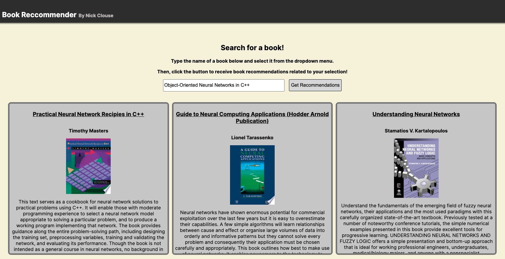

# Book Recommender 
By Nick Clouse
## Table of Contents  
- [Description](#description)  
- [Installation](#installation)  
    - [Prerequisites](#prerequisites)
    - [Downloading](#downloading)
    - [Data Sets](#data-sets)
- [Usage](#usage)  
- [Contact](#contact)  

## Description  
This project is a book recommendation system that utilizes multiple data processing and machine learning techniques to recommend books based on user input.  
   
It uses TF-IDF for text vectorization, converting book details into numerical features, and cosine similarity to measure the similarity between books. Sentiment analysis is used to determine the emotional tone of reviews, which feeds into a logistic regression model along with the review's text porition that predicts book ratings. The system also includes stopword removal to clean text data, sparse matrices for efficient storage, and majority voting to predict book ratings based on the most frequent review scores.

## Installation  

### Prerequisites
- `Python` (3.10.6)
- The following Python libraries installed
  - `NumPy` (2.1.3)
  - `Pandas` (2.2.3)
  - `scikit-learn` (1.6.1)
  - `SciPy` (1.15.1)
  - `NLTK` (3.9.1)
  - `Seaborn` (0.13.2)
  - `Matplotlib.pyplot` (3.10.0)
  - `Swifter` (1.4.0)
  - `re` (2.2.1)
  - `Flask` (3.1.0)

**NOTE:** The version shown above are what I have installed in my environment. This project has not been tested with other versions.

```bash
pip install numpy pandas scipy nltk seaborn matplotlib swifterflask
```
or  
using the provided [requirements.txt](requirements.txt) file, do 
`pip install -r requirements.txt`.  

Ensure you are in a virutal environment before installing (Or don't, up to you).
### Downloading
1. Clone the git repository `git clone https://github.com/CanFam23/BookRecommender`

2. It’s a good practice to use a virtual environment to isolate dependencies (But optional):

On Windows:
```bash 
python -m venv venv
venv\Scripts\activate
```
On macOS/Linux:
```bash
python -m venv venv
source venv/bin/activate
```

### Data Sets
The data sets I used for this project are a bit too large to be uploaded to github (among other issues). To get the data sets, [Contact me](#contact).  
  
For configuration, the data sets should be placed in a folder named data, which is located inside the [webApp](/webApp) folder.

## Usage  

After configuring the project, navigate to the [webApp](webApp) folder and run
```bash
python bookReviewApp.py
```
The project will take several minutes to start up depending on your computer, but once starting the terminal should show
```bash
Loading book data...
Loading rating data...
Fitting book vectorizer...
Creating rating model...
Transforming text...
Fitting rating model...
Recommender loaded!
 * Serving Flask app "bookReviewApp" (lazy loading)
 * Environment: production
   WARNING: This is a development server. Do not use it in a production deployment.
   Use a production WSGI server instead.
 * Debug mode: on
 * Running on http://127.0.0.1:5000/ (Press CTRL+C to quit)
```
If that shows, you can navigate to `http://127.0.0.1:5000/` on any browser and you are good to go!

Start typing the title of a book in the search box, and a list of suggestions will appear. To ensure a successful search, make sure to select a book from the options provided. It may take a few moments for the results to display.

What the page should look like after searching for a book (It'll display up to 9 similar books)


## Future To-Do  
- [ ] Improve the UI, it's pretty simple currently
- [ ] Allow for more books to be used/searched
- [ ] Improve the recommendation algorithm, as well as the rating prediction algorithm. Some of the recommendations for lesser known books aren't the best, and the predicted ratings aren't always super accurate.


## Contact  
[nclouse@carroll.edu](mailto:nclouse@carroll.edu)